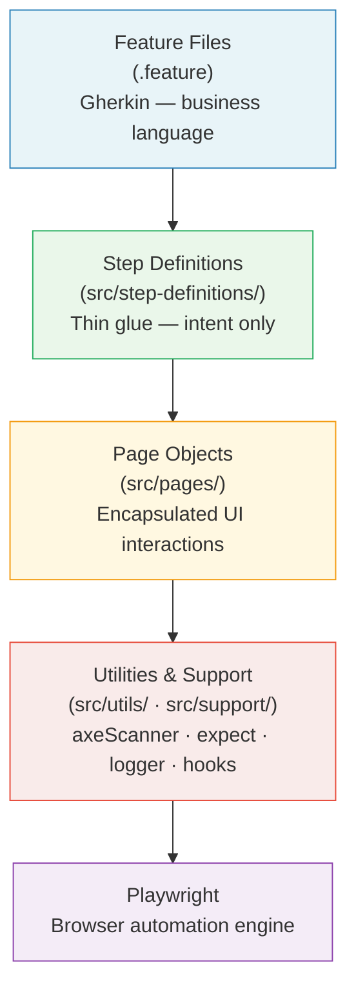

# ParaBank BDD Automation Framework

Enterprise-grade end-to-end test automation for [ParaBank](https://parabank.parasoft.com) — a Spring MVC online banking demo application.

**Stack:** Playwright · TypeScript · Cucumber BDD · Allure Reports · axe-core

---

## Table of Contents

1. [Project Overview](#project-overview)
2. [Features](#features)
3. [Framework Architecture](#framework-architecture)
4. [Project Structure](#project-structure)
5. [Requirements](#requirements)
6. [Installation](#installation)
7. [Running Tests](#running-tests)
8. [Reporting](#reporting)
9. [Accessibility Testing](#accessibility-testing)
10. [Environment Configuration](#environment-configuration)
11. [Code Quality](#code-quality)
12. [Engineering Decisions](#engineering-decisions)
13. [AI Usage](#ai-usage)
14. [Future Improvements](#future-improvements)
15. [Notes on the Shared Demo Server](#notes-on-the-shared-demo-server)

---

## Project Overview

This framework automates the core user journey of the ParaBank banking application — account registration, authentication, and account balance verification — while providing security and WCAG accessibility coverage.

| Concern | Choice | Reason |
|---|---|---|
| **Browser automation** | Playwright | Cross-browser support, reliable auto-waiting, built-in network interception, and first-class TypeScript support |
| **Language** | TypeScript | Compile-time type safety, IDE tooling, and `strict` mode catches defects before tests run |
| **Test framework** | Cucumber BDD | Gherkin scenarios serve as living documentation; non-technical stakeholders can read and validate coverage |
| **Page abstraction** | Page Object Model | Encapsulates UI interactions in one place; step definitions stay thin and readable |
| **Test data** | Factory pattern | Generates unique, structurally-valid data per scenario — safe for parallel runs on shared servers |

---

## Features

| Feature | Implementation |
|---|---|
| Cross-browser execution | Chromium, Firefox, WebKit (Safari engine) — switch via `BROWSER` env var |
| BDD scenarios | Gherkin feature files with business context and test case IDs |
| Page Object Model | Typed page objects with `BasePage` shared behaviour |
| Dynamic test data | Timestamp-based unique usernames; no hard-coded credentials |
| Factory pattern | `buildUser()` in `src/fixtures/factory.ts` — override any field, safe defaults for the rest |
| Typed environment config | Single `EnvironmentConfig` object; no raw `process.env` strings in tests |
| Allure reporting | Auto-generated after every run; screenshots, URLs, console errors on failure |
| Accessibility testing | Functional ARIA/title checks + automated WCAG 2.0/2.1 AA scans via axe-core |
| Reusable utilities | `axeScanner` · `expect` · `logger` · `helpers` · `constants` |
| Structured logging | Contextual logger with configurable level (`LOG_LEVEL=debug`) |
| CI profile | Parallel workers; clean exit codes; gitignored artefacts |

---

## Framework Architecture



**Runtime flow:**

1. Cucumber reads the feature file and matches each step to a step definition.
2. Step definitions call page object methods — they contain no selectors or raw assertions.
3. Page objects use Playwright to interact with the browser via a shared `CustomWorld` context.
4. Cross-cutting concerns (lifecycle, logging, Allure diagnostics) live in `src/support/hooks.ts`.
5. After every scenario, the Allure formatter writes a result file to `allure-results/`.
6. After the full run, `scripts/run-tests.js` invokes the Allure CLI to produce the HTML report.

---

## Project Structure

```
.
├── features/                        # Gherkin feature files
│   ├── e2e_smoke.feature            # End-to-end: register → login → view balance
│   ├── registration.feature         # Account registration — happy path and validation
│   ├── account_overview.feature     # Account balance display after login
│   ├── login.feature                # Login, logout, session management
│   ├── security.feature             # Password masking on authentication forms
│   ├── accessibility.feature        # Page title checks + WCAG axe-core scans
│   └── customer_lookup.feature      # Placeholder (out of scope)
│
├── src/
│   ├── config/
│   │   └── environment.ts           # Typed runtime config — baseURL, browser, timeouts
│   ├── fixtures/
│   │   ├── factory.ts               # Test data builders — unique user per scenario
│   │   └── types.ts                 # TypeScript interfaces for test data
│   ├── pages/                       # Page Object Model
│   │   ├── BasePage.ts              # Shared helpers: locate(), navigate(), textOf()
│   │   ├── LoginPage.ts             # Login form, logout, error message
│   │   ├── RegistrationPage.ts      # Registration form, field submission, success message
│   │   └── AccountOverviewPage.ts   # Account table, balance and account number extraction
│   ├── step-definitions/            # Cucumber step implementations
│   │   ├── common.steps.ts          # Navigation and authenticated session setup
│   │   ├── login.steps.ts           # Login / logout actions and assertions
│   │   ├── registration.steps.ts    # Registration actions and validation assertions
│   │   ├── account.steps.ts         # Balance navigation, capture, and logging
│   │   ├── security.steps.ts        # Password masking assertions
│   │   └── accessibility.steps.ts   # Page navigation + WCAG axe scan step
│   ├── support/
│   │   ├── env.ts                   # Loads .env files; exports EnvironmentConfig
│   │   ├── world.ts                 # CustomWorld — Playwright browser/context/page per scenario
│   │   ├── hooks.ts                 # Before/After lifecycle; screenshot and diagnostics on failure
│   │   └── errors.ts                # Custom error types
│   └── utils/
│       ├── axeScanner.ts            # Reusable axe-core scan utility with Allure output helpers
│       ├── expect.ts                # Pre-configured Playwright expect with framework timeout
│       ├── logger.ts                # Contextual logger — respects LOG_LEVEL
│       ├── helpers.ts               # Pure functions: randomString, randomInt
│       └── constants.ts             # Shared constants
│
├── scripts/
│   ├── run-tests.js                 # Runner: wipes results → Cucumber → Allure report
│   ├── open-report.js               # Serves allure-report/ via HTTP (avoids port conflicts)
│   └── generate-report.js           # Cucumber HTML report builder
│
├── reports/                         # Cucumber HTML/JSON (gitignored, created at runtime)
├── allure-results/                  # Raw Allure result files (gitignored, created at runtime)
├── allure-report/                   # Generated Allure HTML report (gitignored)
├── cucumber.js                      # Cucumber profiles: default, smoke, regression, ci…
├── tsconfig.json                    # strict, NodeNext, exactOptionalPropertyTypes
├── .eslintrc.json
├── .prettierrc
└── .gitignore
```

**Scenario count:** 28 scenarios across 6 active feature files.

---

## Requirements

| Tool | Minimum version |
|---|---|
| Node.js | 18.0.0 |
| npm | 9.0.0 |

---

## Installation

```bash
# 1. Clone the repository
git clone <repository-url>
cd Automation_Task

# 2. Install all npm dependencies
npm install

# 3. Download Playwright browser binaries
npm run playwright:install
```

---

## Running Tests

Every test script automatically:

- Wipes stale `allure-results/` for a clean per-run report
- Executes the selected scenario subset via Cucumber
- Generates a fresh Allure HTML report to `allure-report/`

### Full suite

```bash
npm test                     # All 28 scenarios (default profile)
```

### By test profile

```bash
npm run test:smoke           # @smoke — critical path, fast pre-merge check
npm run test:regression      # @regression — full automated regression suite
npm run test:e2e             # @e2e — register → login → balance end-to-end
npm run test:security        # @security — password masking
npm run test:accessibility   # @accessibility — functional titles + WCAG axe scans
npm run test:ci              # CI: smoke + regression, 4 parallel workers
```

### By feature area

```bash
npm run test:registration    # @registration scenarios only
npm run test:login           # @login scenarios only
npm run test:account         # @account scenarios only
```

### Browser and environment

```bash
npm run test:headed          # Visible browser window — useful for local debugging
npm run test:firefox         # Firefox
npm run test:safari          # WebKit (Safari engine)
npm run test:staging         # Against staging server (requires .env.staging)
npm run test:production      # Against production server (requires .env.production)
```

### Utilities

```bash
npm run test:dryrun          # Verify all steps are defined — 0 undefined expected
npm run clean                # Delete all generated artefacts (reports, allure dirs, dist)
```

---

## Reporting

### Allure Report

The Allure report is generated automatically after every test run. No additional command is needed.

```bash
npm run report:open          # Serve the latest report and open it in the browser
npm run report:generate      # Manually regenerate the HTML report from allure-results/
```

#### Report contents

| Section | Content |
|---|---|
| **Overview** | Pass/fail counts, suite breakdown, trend graph |
| **Environment** | Browser, environment, base URL, Node.js version, Playwright version |
| **Suites** | Scenarios grouped by feature: ParaBank → Login / Registration / etc. |
| **Tags** | Filter by `@smoke`, `@regression`, `@login`, `@security`, `@accessibility` |
| **Attachments — failures** | Full-page screenshot · current URL · browser console errors |
| **Attachments — accessibility** | Screenshot · violation summary (text) · full scan result (JSON) |

### Screenshots

On scenario failure, a full-page screenshot is captured by the `After` hook and embedded inline in the Allure report. No manual configuration is needed.

### Cucumber HTML Report

```bash
npm run report:html          # Generates reports/cucumber-report.html
```

### Logging

```bash
LOG_LEVEL=debug npm test     # Verbose Playwright action tracing
```

Log levels: `debug` · `info` (default) · `warn` · `error`

---

## Accessibility Testing

Two complementary layers of accessibility coverage are implemented.

### Layer 1 — Functional tests

Standard Cucumber scenarios verifying observable accessibility behaviour without external tooling:

| TC | Scenario | WCAG criterion |
|---|---|---|
| ACS-006 | Home page has a descriptive browser tab title | 2.4.2 Page Titled |
| ACS-006 | Registration page has a descriptive browser tab title | 2.4.2 Page Titled |

These scenarios always pass on a correctly deployed instance and run as part of `@regression`.

### Layer 2 — Automated WCAG scans (axe-core)

Powered by `@axe-core/playwright` (Deque Systems). The reusable `src/utils/axeScanner.ts` utility runs WCAG 2.0 A / 2.0 AA / 2.1 AA rules against each page and attaches structured results to Allure.

| TC | Page scanned | Login required |
|---|---|---|
| ACS-010 | Home (login form) | No |
| ACS-010 | Registration | No |
| ACS-011 | Accounts Overview | Yes — auto-registered per scenario |

**Failure threshold:** Only `critical` impact violations fail the scenario.  
`serious`, `moderate`, and `minor` violations are attached as informational warnings without blocking.

```bash
npm run test:accessibility
```

#### Known violations on the shared demo server

The public ParaBank application has pre-existing accessibility violations outside the test team's control:

| Rule | Impact | Description |
|---|---|---|
| `html-has-lang` | Critical | `<html>` missing `lang` attribute — all pages |
| `image-alt` | Critical | Admin icon `` missing `alt` — authenticated pages |
| `link-name` | Serious | Admin navigation link has no discernible text |

The axe-core scenarios **correctly fail** against the shared demo server because these are genuine WCAG violations. On a compliant deployment the scenarios would pass.

#### How to read an accessibility failure in Allure

1. Run `npm run report:open`
2. Navigate to **Suites → ParaBank → Accessibility**
3. Click the failed scenario
4. Open the **Violation Summary** attachment for a human-readable breakdown
5. Open **Full Scan Result** (JSON) for the raw axe-core output
6. The PNG screenshot shows the exact page state when the scan ran

Violation entry format:

```
### [CRITICAL] html-has-lang
**Ensure every HTML document has a lang attribute**
📖 Help: https://dequeuniversity.com/rules/axe/4.12/html-has-lang

**Affected elements:**
- `html`
  - Fix any of the following: The <html> element does not have a lang attribute
```

#### Remediation guidance

| Impact | Action |
|---|---|
| Critical | Block release — fix before merge |
| Serious | P1 bug — fix in current sprint |
| Moderate | P2 bug — schedule for next sprint |
| Minor | Accessibility backlog |

---

## Environment Configuration

Copy `.env.example` to `.env` and adjust values for your deployment.

| Variable | Default | Description |
|---|---|---|
| `BASE_URL` | `https://parabank.parasoft.com` | Application under test |
| `BROWSER` | `chromium` | `chromium` · `firefox` · `webkit` |
| `HEADLESS` | `true` | Set `false` to show the browser window |
| `SLOW_MO` | `0` | Milliseconds between Playwright actions (debugging aid) |
| `DEFAULT_TIMEOUT` | `30000` | Step timeout in milliseconds |
| `NAVIGATION_TIMEOUT` | `30000` | Page navigation timeout in milliseconds |
| `TEST_ENV` | _(unset)_ | Loads `.env.<TEST_ENV>` (e.g. `staging` → `.env.staging`) |
| `LOG_LEVEL` | `info` | `debug` · `info` · `warn` · `error` |

Multi-environment example:

```bash
TEST_ENV=staging npm run test:regression
```

---

## Code Quality

```bash
npm run typecheck            # TypeScript type-check — zero errors expected
npm run lint                 # ESLint with TypeScript rules
npm run lint:fix             # ESLint with auto-fix
npm run format               # Prettier — .ts, .feature, .json, .js
npm run format:check         # Prettier non-mutating check (CI-safe)
```

TypeScript is configured with `strict: true`, `noUnusedLocals`, `noUnusedParameters`, `exactOptionalPropertyTypes`, and `noImplicitReturns`. Any type error is a build failure.

---

## Engineering Decisions

| Decision | Rationale |
|---|---|
| **Playwright** | Modern auto-waiting eliminates flaky `sleep()` calls. Isolated browser contexts (not new browser instances) per scenario give full session isolation at low cost (~5 ms per context vs ~300 ms per browser launch) |
| **Cucumber BDD** | Feature files are living documentation. A non-technical product owner can validate that the automation covers the agreed acceptance criteria without reading TypeScript |
| **Page Object Model** | Selectors live in one place. When the UI changes, only the page object changes — not every step that touches that element |
| **Dynamic test data** | Unique timestamp-based usernames prevent test collisions on the shared demo server and in parallel runs. `buildUser()` returns a fully-typed object that supports field-level overrides |
| **Thin step definitions** | Steps express intent ("the user logs in with those credentials") and delegate mechanics to the page object. This keeps Gherkin composable and step files readable |
| **Reusable utilities** | `axeScanner.ts`, `expect.ts`, and `logger.ts` are imported wherever needed. A single change propagates to every consumer — no copy-paste maintenance |
| **Allure over console logs** | Allure preserves run history, embeds screenshots and structured logs per scenario, and supports tag-based filtering — far more actionable than terminal output for diagnosing CI failures |
| **axe-core** | Industry-standard accessibility engine used by government compliance programmes. `@axe-core/playwright` is the official, actively maintained Playwright integration from Deque Systems |
| **Critical-only failure threshold** | Blocking on every accessibility warning would make the suite permanently red on any legacy application. Blocking only on `critical` violations aligns with common enterprise WCAG compliance gates while still surfacing lower-impact issues in the report |

---

## AI Usage

GitHub Copilot (Claude Sonnet 4.6) was used as an engineering assistant throughout the development of this project to accelerate implementation and documentation.

Its use included:

* **Implementation assistance** — Generating initial implementations for step definitions, page objects, utilities, and repetitive boilerplate based on clearly defined requirements.
* **Code review support** — Suggesting refactorings, identifying potential improvements, and highlighting opportunities to simplify or improve maintainability.
* **Documentation assistance** — Assisting with README structure, project documentation, and implementation summaries.

All AI-generated output was manually reviewed before being incorporated into the project.

Architecture, framework design, technology selection, and engineering decisions—including the Page Object Model, Cucumber BDD structure, dynamic test data strategy, reporting approach, and accessibility integration—were evaluated and validated by the author.

Where AI suggested unnecessary abstractions or overly complex implementations, those suggestions were simplified or rejected to keep the framework maintainable and aligned with enterprise software craftsmanship principles.

Every automated scenario was executed locally, and the final implementation was validated through successful test execution and report verification before submission.

AI served as a productivity tool to accelerate development, while responsibility for the final implementation, code quality, and technical decisions remained with the author.


---

## Future Improvements

These enhancements are not yet implemented and represent realistic next steps for a production-scale version of this framework.

| Enhancement | Description |
|---|---|
| **Dedicated test server** | Deploy a private ParaBank container for CI to eliminate interference from the public shared demo |
| **Cross-browser execution matrix** | Run the full regression suite across Chromium, Firefox, and WebKit in a single CI pipeline invocation |
| **Parallel execution tuning** | Validate and increase the CI profile worker count; resolve any shared-state issues to reduce suite duration |
| **Visual regression testing** | Integrate Playwright's screenshot comparison to catch unintended UI changes between releases |
| **API contract testing** | Add Pact or OpenAPI validation to test ParaBank's REST endpoints independently of the frontend |
| **Docker support** | Package the framework and browser binaries in a Docker image for reproducible CI execution without local Playwright installation |
| **Performance baseline** | Capture `performance.timing` metrics during E2E scenarios and assert against agreed response-time thresholds |
| **Accessibility baseline tracking** | Persist axe-core violation counts across runs; fail only when the count increases beyond an accepted baseline — enables gradual remediation without permanently broken builds |

---

## Notes on the Shared Demo Server

Tests run against the public ParaBank demo at `https://parabank.parasoft.com`.

This is a shared instance — all users worldwide register on the same database. The framework uses unique timestamp-based usernames (`usr<base36-timestamp>`) to avoid collisions. Some scenarios may fail intermittently when the server is under load or in a degraded state. For stable, repeatable CI results, deploy a dedicated ParaBank instance.

| Scenario | Behaviour when server is degraded |
|---|---|
| LOG-007 — unrecognised credentials | Fails — server accepts all credentials |
| ACS-010 / ACS-011 — WCAG axe scans | Fail — server has genuine accessibility violations |
